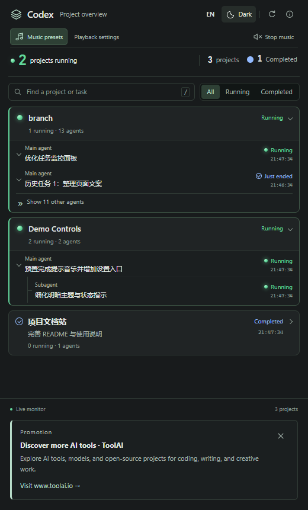

# Codex Finish Shout

[English](README.md) | [简体中文](README.zh-CN.md)

A local Windows extension for VS Code that monitors Codex projects and agent activity, confirms project-wide completion, and plays offline music. Includes English/Chinese UI, light/dark themes, a playback queue, and three bundled melodies.

> **Promotion · Discover more AI tools · ToolAI**  
> Explore AI tools, models, and open-source projects for coding, writing, and creative work.  
> **[Visit www.toolai.io →](https://www.toolai.io/)**

## Install the preview

1. Download the Windows x64 `.vsix` from [GitHub Releases](https://github.com/littledot2020/codex-finish-shout/releases).
2. In VS Code, open Extensions → **… → Install from VSIX…**.
3. Run **Codex Finish Shout: Initialize Backend**. This installs the bundled PowerShell backend and backs up and updates Codex `notify` and lifecycle Hook settings.
4. Use **Complete Security Authorization** to trust the lifecycle Hook in Codex, then reload VS Code.
5. Run a Codex task. When all project activity settles for the default 10-second window, the reminder plays.

The VSIX includes the player, backend, and music. Users do not need source code, Node.js, music downloads, or a separate player. Playback and speech use Windows components.

**Support:** trusted local Windows x64 VS Code workspaces. The manifest declares VS Code 1.90 or later; see [validation status](docs/VALIDATION.md) for tested environments. Requires Codex with compatible user-level completion notifications and lifecycle Hooks. Other operating systems, remote SSH/WSL/container execution, and browser VS Code are not supported in this preview. Initialization alone does not establish compatibility with a particular Codex version.

## Music and monitoring



Run **Open Project Monitor** to see active projects and individual agent tasks. Search, filters and expandable history help keep current work visible. Use the overview controls to switch English/Chinese and light/dark themes.

| Built-in cue | ID | Duration |
|---|---|---|
| Soft chime | `soft-chime` | 2.4 s |
| Bright finish | `bright-finish` | 2.2 s |
| Gentle rise | `gentle-rise` | 3.2 s |

**Music presets** selects a cue or a local MP3/WAV/WMA/M4A/AAC file (codec availability applies). **Playback settings** offers once, loop, or a duration. Volume, announcements and quiet hours remain configurable. `Ctrl+Alt+M` stops music and the queue; `Ctrl+Alt+P` opens playback settings. MIDI sources are included; playback uses MP3.

Built-in choices use `builtin:<id>` so upgrades do not depend on old extension directories. Personal files stay local. Optional serial hardware is disabled for new installations; existing hardware settings are retained. See [hardware documentation](hardware/README.md).

## Upgrade, repair and uninstall

- Migrating from `local-developer.codex-finish-shout-controls`: disable/uninstall the old extension and reload before enabling this version. Publisher changes create a new identity; existing `codexFinishShout.*` settings and backend preferences remain usable.
- After updating the extension, run **Repair / Update Backend**. It preserves preferences, backs up existing files, serializes concurrent installs and restores changed files after installation failure.
- **Check Backend Status** displays installation and observed Hook readiness. Conflicting `notify` settings are reported rather than overwritten.
- Before removing the extension, run **Uninstall Backend**. It removes owned registrations and runtime files, restores a saved notification handler when applicable, and keeps preferences/backups. Removing the VSIX alone does not clean user-level Hooks.
- Default data root: `%USERPROFILE%\.codex`, or `CODEX_HOME` when configured. Runtime: `codex-finish-shout`; settings: `codex-finish-shout.json`; status: `codex-finish-shout-state`.

## ToolAI promotion and privacy

The overview has a **Promotion** footer linking to [ToolAI](https://www.toolai.io/). Close it once to hide it across reloads and upgrades. Re-enable with `codexFinishShout.promotion.showToolAI`. Language follows the overview. No remote advertising scripts, click tracking or automatic browser popups are added; the site opens only when clicked.

Monitoring reads local Codex state and may read conversation records to display task titles. This extension does not upload task data. Redact private prompts, paths and settings before reporting issues. See [Privacy / 隐私说明](docs/PRIVACY.md).

## Develop and publish

Build/test tools: Node.js 24 and Windows PowerShell 5.1.

```powershell
npm ci
npm test
npm run test:backend
npm run package
npm run test:package
```

Press **F5** for isolated development, then run `npm run dev:simulate` in another terminal. Development data lives in `.dev/`; real Hook testing uses a separate Windows test account. See the bilingual [development guide](docs/DEVELOPMENT.md) and [publishing guide](docs/PUBLISHING.md).

`0.11.x` is a preview; `0.12.0` is reserved for the first validated integrated stable release. Feature branches merge into `main`. CI tests/packages changes, and `v*` tags publish GitHub preview releases. Marketplace uploads use the exact same VSIX. A GitHub release does not imply Marketplace availability.

## License and support

Code: [MIT](LICENSE). Original music: [redistribution terms](codex-finish-shout/assets/music/LICENSE.txt). Hardware dependencies keep their own licenses. This independent project is not an official OpenAI or Microsoft extension.

[Report a bug](https://github.com/littledot2020/codex-finish-shout/issues) · [Changelog](CHANGELOG.md)
