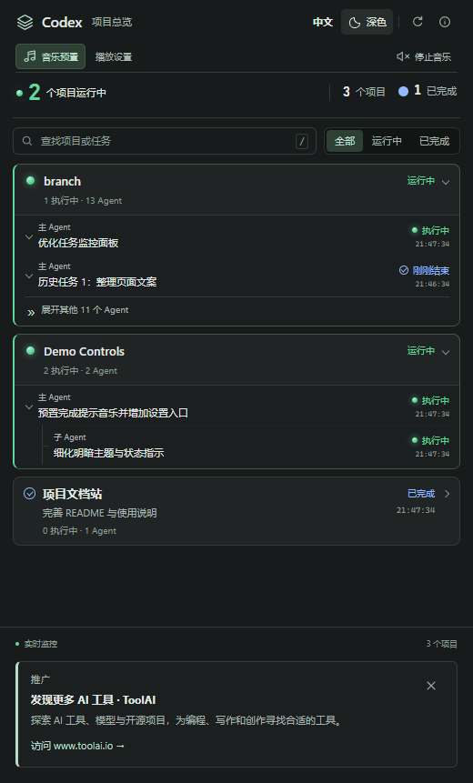

# Codex Finish Shout

[English](README.md) | [简体中文](README.zh-CN.md)

面向 Windows 本机 VS Code 的 Codex 项目监控和完成音乐扩展。汇总项目与 Agent 活动，在项目整体完成后播放离线提示音乐；支持中英文、深浅主题、播放队列及三首内置旋律。

> **推广 · 发现更多 AI 工具 · ToolAI**  
> 探索 AI 工具、模型与开源项目，为编程、写作和创作寻找合适的工具。  
> **[访问 www.toolai.io →](https://www.toolai.io/)**

## 安装预览版

1. 在 [GitHub Releases](https://github.com/littledot2020/codex-finish-shout/releases) 下载 Windows x64 `.vsix`。
2. 打开 VS Code 扩展视图，选择 **… → 从 VSIX 安装…**。
3. 在命令面板执行 **Codex Finish Shout: 初始化后端**。扩展将安装包内的 PowerShell 后端，并备份、更新 Codex 的 `notify` 与生命周期 Hook 配置。
4. 执行 **完成安全授权**，在 Codex 中信任生命周期 Hook，然后重新加载 VS Code。
5. 提交 Codex 任务。项目内全部活动结束并经过默认 10 秒确认窗口后，播放完成提醒。

VSIX 已包含播放器、后端和音乐，使用时不需要下载源码、安装 Node.js、下载音乐或另装播放器。声音和语音功能使用 Windows 自带组件。

**支持范围：**受信任的 Windows x64 本机工作区。清单声明 VS Code 1.90 及以上，实际测试范围见[验证记录](docs/VALIDATION.md)。需要 Codex 支持兼容的用户级完成通知与生命周期 Hook。此预览版暂不支持其他操作系统、远程 SSH、WSL、容器执行及网页版 VS Code。Hook 能力随 Codex 版本变化，初始化成功不代表事件兼容性已验证。

## 音乐与项目监控



执行 **打开项目总览** 查看活动项目、主 Agent 和子 Agent；可搜索任务、筛选状态、展开历史。界面支持英文／中文和深色／浅色。

| 内置音乐 | 标识 | 时长 |
|---|---|---|
| 轻柔风铃 | `soft-chime` | 2.4 秒 |
| 明亮完成 | `bright-finish` | 2.2 秒 |
| 舒缓上扬 | `gentle-rise` | 3.2 秒 |

通过 **音乐预置** 选择内置旋律或个人本地 MP3/WAV/WMA/M4A/AAC 文件，具体格式受 Windows 编解码器支持情况影响。**播放设置** 支持播放一次、循环或指定秒数，并保留音量、语音播报和免打扰设置。`Ctrl+Alt+M` 停止当前音乐和队列，`Ctrl+Alt+P` 打开播放设置。随包 MIDI 用于旋律源文件，实际播放使用 MP3。

内置曲目以 `builtin:<id>` 保存，不依赖旧版本扩展安装路径。个人歌曲仅保留在本机。全新安装默认关闭可选串口硬件功能，升级保留原有配置；详见[硬件说明](hardware/README.md)。

## 升级、修复与卸载

- 从 `local-developer.codex-finish-shout-controls` 迁移时，先禁用或卸载旧扩展并重新加载窗口，再启用新版。发布者变更会形成新扩展身份，现有 `codexFinishShout.*` 设置和后端偏好可继续使用。
- 更新扩展后执行 **修复／更新后端**。安装会备份已有文件、保留个人偏好，并通过锁避免多窗口重复安装；安装失败恢复已修改文件。
- 执行 **检查后端状态** 查看安装及 Hook 实际运行证据。已有其他 `notify` 配置发生冲突时会报告问题，不会静默覆盖。
- 卸载扩展前先执行 **卸载后端**，清理本插件注册项及运行文件，在适用时恢复之前保存的通知处理器，保留设置和备份。只卸载 VSIX 不会自动清理用户级 Hook。
- 默认数据根目录为 `%USERPROFILE%\.codex`，设置 `CODEX_HOME` 时使用对应目录。运行文件为 `codex-finish-shout`，设置文件为 `codex-finish-shout.json`，状态目录为 `codex-finish-shout-state`。

## ToolAI 推广与隐私

项目总览底部显示标注“推广”的 [ToolAI](https://www.toolai.io/) 入口，可关闭，重启和升级后仍保持隐藏；通过 `codexFinishShout.promotion.showToolAI` 重新开启。推广文案跟随界面语言。扩展不加载远程广告脚本，仅在点击时打开网站，不添加点击采集、自动弹窗或声音广告。

监控在本地读取 Codex 状态，并可能读取本地会话记录以展示任务标题。本扩展不上传任务数据。公开反馈问题时，请移除私人提示词、路径和配置内容。详见[隐私说明](docs/PRIVACY.md)。

## 开发与发布

构建测试使用 Node.js 24 和 Windows PowerShell 5.1。

```powershell
npm ci
npm test
npm run test:backend
npm run package
npm run test:package
```

在仓库中按 **F5** 启动隔离开发窗口，并在另一个终端执行 `npm run dev:simulate` 创建模拟项目。开发配置和快照保存在 `.dev/`，真实 Hook 联调使用独立 Windows 测试账户。详见双语[开发指南](docs/DEVELOPMENT.md)及[发布指南](docs/PUBLISHING.md)。

`0.11.x` 为预览版本，首个通过完整验证的一体化正式版计划为 `0.12.0`。功能分支合并到 `main`；CI 测试并打包每次变更，`v*` 标签生成 GitHub 预发布。商店使用同一份 VSIX。GitHub 已发布不代表商店已上架。

## 许可与反馈

代码使用 [MIT](LICENSE)；原创音乐附带[独立分发许可](codex-finish-shout/assets/music/LICENSE.txt)。硬件第三方依赖保留各自许可。本项目为独立开发，不是 OpenAI 或 Microsoft 官方扩展。

[反馈问题](https://github.com/littledot2020/codex-finish-shout/issues) · [更新日志](CHANGELOG.md)
